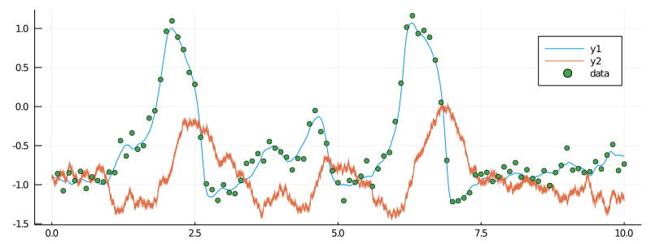

# [Defining an observation scheme for a single trajectory from the FitzHugh–Nagumo model](@id tutorial_single_path)
***
> In this tutorial we simulate data from the FitzHugh–Nagumo model and then show how to decorate it with information provided by [ObservationSchemes.jl](https://github.com/JuliaDiffusionBayes/ObservationSchemes.jl).

## Generating complete data
-----
For this tutorial we will generate some data from the hypoelliptic, stochastic FitzHugh–Nagumo model that you can [read more about here](https://juliadiffusionbayes.github.io/DiffusionDefinition.jl/dev/predefined_processes/fitzhugh_nagumo/). To this end, we will use the functionality from the package [DiffusionDefinition.jl](https://juliadiffusionbayes.github.io/DiffusionDefinition.jl/dev/).
```julia
using DiffusionDefinition, StaticArrays
@load_diffusion FitzHughNagumo

P = FitzHughNagumo(0.1, -0.8, 1.5, 0.0, 0.3)
tt = 0.0:0.0001:10.0
x0 = @SVector [-0.9, -0.9]
X = rand(P, tt, x0)
```
`X` above contains very high frequency observations (conceptually: a continuous recording) of both coordinates of the process without any extrinsic noise. However, when collecting real data one rarely has the luxury of being able to record all coordinates of the process, exactly and without any extrinsic noise. Instead, a very common setup is to record a subset of coordinates perturbed by some noise that is often assumed to be Gaussian. In mathematical notation this becomes:
```math
V_t=LX_t+ξ,\quad ξ∼N(μ,Σ),\quad\mbox{for }t\in\{t_1,t_2,\dots\},
```
where $L$, $Σ$ and $μ$ are matrices and a vector of appropriate dimension. To define this types of observation with [ObservationSchemes.jl](https://juliadiffusionbayes.github.io/ObservationSchemes.jl/dev/) we can use struct `LinearGsnObs`. Each observation must be decorated separately and becomes its own instance of `LinearGsnObs`. Consequently, for each observation we must indicate the time of its collection as well as its value and pass the two to a constructor of `LinearGsnObs`. We can optionally (and often will have to) specify the matrix `L` (which by default is assumed to be an identity matrix `I`), matrix `Σ` (which by default is assumed to be `1e-11*I`) and a vector `μ` (which by default is assumed to be a zero vector). In principle, we could even change `L`, `μ` and `Σ` from observation to observation, having as many observation schemes as there are observations, but we will (hopefully) rarely have to do that.


## Observations of a single coordinate
------
FitzHugh–Nagumo model is used primarily to model the time evolution of the membrane potential. As in practice only the membrane potential itself is recorded (and corresponds to the values taken by the first coordinate) we will use:
```math
L:=\left[\begin{matrix}1& 0\end{matrix}\right].
```
We will also assume noisy measurements with Gaussian noise $N(0,0.1^2)$ made every $0.1$ seconds. Consequently, each observation has the following format:
```julia
using ObservationSchemes
obs_template = LinearGsnObs(
    0.0, # dummy time variable
    (@SVector [0.0]); # dummy observation of a first coordinate
    L = (@SMatrix [1.0 0.0;]),
    Σ = (@SMatrix [0.01]),
)
```
We could decorate every single observation separately, however, as all of them have the same format we can use a struct `ObsScheme` to define a template that can be applied to decorating the data efficiently. As there is only one observation type the `obs_template` is the only object we need to pass to `ObsScheme`:
```julia
obs_scheme = ObsScheme(obs_template)
```
If there were more than a single type of observation, then we could pass all of them to `ObsScheme` and then declare the pattern according to which different observations are to be selected. For more information see [this page](@ref obs_scheme).

As we don't yet have the raw data, only the entire, simulated process we should first reduce it down to raw data (which would be a list of time-points and a list of corresponding observations of the first coordinate) and then we could call `load_data` to apply `obs_scheme` to the raw data. However, we can also do all of that in a single step by calling `collect` to collect the data according to the `obs_scheme` directly from the simulated data:
```julia
data = collect(obs_scheme, X, 1000, true)
```
The `1000` indicates that only `1` in a `1000` points from `X` are supposed to be recorded. This corresponds exactly to `1` point every `0.1` seconds. `true` is a flag for omitting the initial point. We can now plot the simulated trajectory together with our data:
```julia
const OBS = ObservationSchemes
using Plots
plot(X, Val(:vs_time), size=(800, 300))
scatter!(map(x->x.t, data), map(x->OBS.ν(x)[1], data), label="data")
```


## Full code from the tutorial
----
```julia
using DiffusionDefinition, StaticArrays
using ObservationSchemes, Plots, Random # Random used only for seeding
const OBS = ObservationSchemes

# use this seed for reproducing the tutorial exactly
Random.seed!(8)

@load_diffusion FitzHughNagumo
P = FitzHughNagumo(0.1, -0.8, 1.5, 0.0, 0.3)
tt = 0.0:0.0001:10.0
x0 = @SVector [-0.9, -0.9]
X = rand(P, tt, x0)

obs_template = LinearGsnObs(
    0.0, # dummy time variable
    (@SVector [0.0]); # dummy observation of a first coordinate
    L = (@SMatrix [1.0 0.0;]),
    Σ = (@SMatrix [0.01]),
)
obs_scheme = ObsScheme(obs_template)
data = collect(obs_scheme, X, 1000, true)

plot(X, Val(:vs_time), size=(800, 300))
scatter!(map(x->x.t, data), map(x->OBS.ν(x)[1], data), label="data")
```
